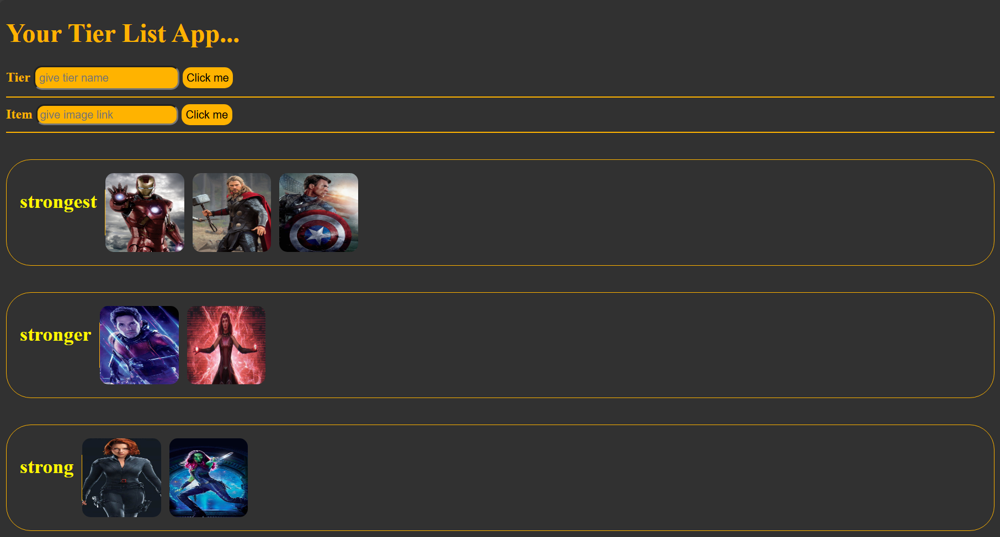

# Drag and Drop Tier List App

This is a simple drag-and-drop tier list application where users can create custom tier lists and add items to them. The app allows users to organize items by dragging and dropping them into different tiers.

## Features

- **Create Tier Lists**: Users can create new tier lists by entering a name and clicking the "Click me" button.
- **Add Items**: Users can add items by providing an image URL and clicking the "Click me" button.
- **Drag and Drop**: Items can be dragged and dropped into different tier lists for easy organization.
- **Double-Click to Reset**: Double-clicking an item moves it back to the "non-tier" section.

## How to Use

1. **Create a Tier List**:
   - Enter a name for your tier list in the "Tier" input field.
   - Click the "Click me" button to create the tier list.

2. **Add Items**:
   - Enter an image URL in the "Item" input field.
   - Click the "Click me" button to add the item to the "non-tier" section.

3. **Organize Items**:
   - Drag an item from the "non-tier" section and drop it into a tier list.
   - To reset an item, double-click it to move it back to the "non-tier" section.

## Repository

You can find the repository at: [GitHub Repository URL](https://github.com/your-repo-link)

## Screenshot

## Technologies Used

- **HTML**: For the structure of the app.
- **CSS**: For styling the app.
- **JavaScript**: For implementing the drag-and-drop functionality and event handling.

## Setup

1. Clone or download the repository.
2. Open the `DOM manipulation.html` file in your browser to run the app.

